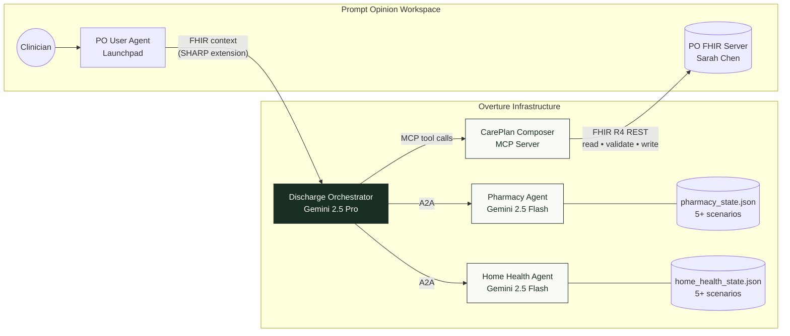
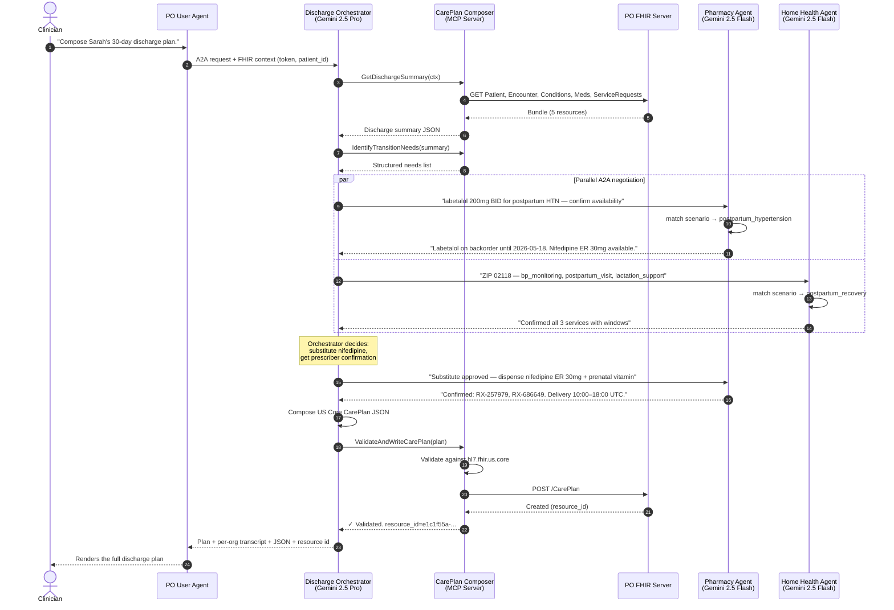
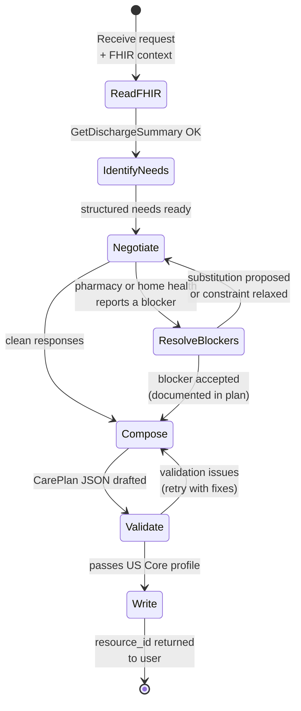

<div align="center">

# Overture

### Multi-agent infrastructure for healthcare workflows

*Composing validated US Core CarePlans through real-time, cross-organizational AI negotiation.*

[](https://app.promptopinion.ai)
[](https://github.com/anthropics/anthropic-cookbook)
[](https://www.hl7.org/fhir/us/core/)
[](https://ai.google.dev/)
[](#license)

</div>

---

## What is Overture

Overture is a **multi-agent system that automates cross-organizational care coordination**. A single clinical request — *"compose this patient's 30-day post-discharge plan"* — triggers a real-time negotiation between three independent Gemini-powered agents (hospital orchestrator, specialty pharmacy, home health agency) and writes a validated US Core CarePlan back to the FHIR server.

Built on the open **A2A** (Agent-to-Agent) and **MCP** (Model Context Protocol) standards. No central hub. No proprietary integrations. Any organization can join the network by exposing an A2A agent.

> **The headline beat:** when the pharmacy reports a medication backorder mid-conversation, the orchestrator decides on its own to substitute a clinically equivalent alternative, gets prescriber confirmation, and updates the plan in flight. **No human in the loop. ~90 seconds end-to-end.**

---

## Table of contents

| Section | Purpose |
|---|---|
| [The problem](#the-problem) | Why this exists |
| [How it works](#how-it-works) | One-paragraph product description |
| [Architecture](#architecture) | Mermaid diagrams of the system |
| [Demo walkthrough](#demo-walkthrough) | End-to-end Sarah Chen scenario |
| [Multi-protocol design](#multi-protocol-design) | When to use A2A vs MCP |
| [Tech stack](#tech-stack) | Concrete dependencies |
| [Quick start](#quick-start) | Run locally in 10 minutes |
| [Production deployment](#production-deployment) | Render setup |
| [Project structure](#project-structure) | Annotated directory tree |
| [Engineering decisions](#engineering-decisions) | Why we chose what we chose |
| [Roadmap](#roadmap) | What's next |

---

## The problem

Hospital discharge is among the most operationally fragile moments in US healthcare. A single 30-day post-discharge plan typically requires a human coordinator to spend **three days** brokering faxes, phone calls, and portal logins across:

- The patient's **specialty pharmacy** (medication availability, prior auth, delivery scheduling)
- A **home health agency** (BP monitoring, postpartum visits, lactation, DME, skilled nursing)
- The **payer** (coverage verification, prior auth approval, formulary checks)
- **Downstream specialists** (cardiology, endocrinology, social work follow-ups)

The same FHIR context is re-keyed at every hop. Errors are common. Care gets delayed. Patients get readmitted.

Industry estimates put the total US prior-authorization burden at **$25–35 billion annually**, spanning transaction costs, physician practice time, and care delays. The CAQH Index alone reports $11B+ in pure transaction cost; AMA estimates push the total well into the tens of billions when downstream impacts are counted.

### What's broken

| | Today | What it should be |
|---|---|---|
| **Latency** | 2–3 days | Seconds |
| **Coordination** | Phone, fax, portal logins | Structured agent-to-agent messages |
| **Data integrity** | Re-keyed at every hop | FHIR context flows end-to-end |
| **Error surface** | Silent failures, denials | Auditable, machine-readable |
| **Substitutions** | Pharmacist → MD callback loop | Live in-protocol negotiation |

Overture is the protocol layer that makes the right column possible.

---

## How it works

The user sends one clinical request to the **Discharge Orchestrator** — a Gemini-powered A2A agent registered in the Prompt Opinion platform. The orchestrator runs a deterministic 5-step workflow:

1. **Reads the patient's chart** from the FHIR server via the CarePlan Composer MCP server (encounter, active conditions, medications, service requests).
2. **Identifies transition needs** — translates the discharge summary into a structured list of meds, services, and follow-ups.
3. **Opens parallel A2A conversations** with the specialty pharmacy and home health agencies. Each is an independent agent on its own server, with its own LLM and its own state. No shared memory.
4. **Resolves blockers in flight.** If pharmacy reports a backorder, the orchestrator decides on a clinical substitute and re-validates with the prescriber. If home health can't cover a service, it surfaces that as a real blocker rather than fabricating a confirmation.
5. **Composes a US Core compliant CarePlan** as JSON, validates it against `hl7.fhir.us.core` via MCP, and writes the resource to the FHIR server. Returns a real, queryable resource id.

The output is **not a chatbot summary** — it is a structured FHIR resource that any production EHR (Epic, Cerner, athenahealth) can ingest directly.

---

## Architecture

### High-level system



PO sees **one external A2A agent** (the orchestrator) and **one MCP server** (the CarePlan Composer). The two specialist agents are reached directly by the orchestrator over A2A — never registered in PO. From the user's perspective, this looks like a single product. From the architecture's perspective, it is a federated network.

### Live request: the substitution scenario



This sequence runs in approximately 90 seconds. The substitution decision (steps 9–11) is made by the orchestrator's LLM in real time — it is not pre-scripted, not pattern-matched, not template-driven. The orchestrator reads pharmacy's reply, reasons over alternatives appropriate for postpartum hypertension (informed by ACOG guidance encoded in the agent's instruction), and re-engages the pharmacy with a substitution decision.

### Workflow state machine



The orchestrator is **forbidden by its system prompt from responding to the user before reaching the Write state** — this is what guarantees every response includes a real FHIR resource id, not a fabricated summary.

---

## Demo walkthrough

### The patient

**Sarah Chen** — 32 y.o., postpartum day 3, severe preeclampsia. Discharged home with home health support. Active prescriptions: labetalol 200mg BID for postpartum hypertension; prenatal multivitamin daily. Documented in `scenarios/postpartum_demo_patient.json` as a US Core compliant FHIR Bundle (Patient + Encounter + 2 Conditions + 2 MedicationRequests + ServiceRequest).

### The clinical ask

> *"Consult the Discharge Orchestrator. Compose the 30-day post-discharge care plan for Sarah, and specifically confirm same-day medication delivery and a postpartum nurse visit within the first 24 hours. Surface any blockers."*

### What happens, beat by beat

| Time | Event |
|---|---|
| **0:00** | PO Launchpad receives the prompt. PO injects FHIR context (server URL, access token, patient ID) into the A2A request to the orchestrator. |
| **0:02** | Orchestrator calls `GetDischargeSummary` over MCP. The MCP server fetches Patient, Encounter, Conditions (active), MedicationRequests (active), and ServiceRequests from the FHIR server in parallel. |
| **0:08** | Orchestrator calls `IdentifyTransitionNeeds` and pre-formats negotiation messages with patient ZIP, dose, indication. |
| **0:12** | Parallel A2A: pharmacy and home health receive simultaneous requests. Each agent matches keywords against its scenario library. |
| **0:25** | Pharmacy responds: *"Labetalol 200mg PO BID is on manufacturer backorder until 2026-05-18. Nifedipine ER 30mg PO daily is in stock — first-line per ACOG for postpartum hypertension."* |
| **0:25** | Home health responds: *"Service area confirmed for ZIP 02118. BP cuff delivery today 16:00–18:00 UTC. Postpartum nurse visit tomorrow 09:00–17:00 UTC. Lactation support day after, 10:00–16:00 UTC."* |
| **0:30** | **The substitution moment.** Orchestrator decides to substitute, sends prescriber-confirmation message back to pharmacy. |
| **0:42** | Pharmacy commits: *"Nifedipine ER 30mg + prenatal vitamin dispensed. RX-257979, RX-686649. Delivery window 10:00–18:00 UTC."* |
| **0:48** | Orchestrator composes a US Core CarePlan JSON with 5 activities (substituted med + vitamin + 3 home health services) and full required metadata (`meta.profile`, `text.div`, `category`, `subject`, `activity[]`). |
| **0:55** | `ValidateAndWriteCarePlan` runs validation against `hl7.fhir.us.core` profile, then POSTs to `/CarePlan`. |
| **0:58** | FHIR server returns `201 Created` with a real resource id. |
| **1:00** | Orchestrator returns the assembled plan to PO with the closing line: ***✓ US Core CarePlan validated against hl7.fhir.us.core. Resource id: e1c1f55a-24a3-4f81-bb1b-c63c67f38301*** |

The resource id is queryable from the FHIR server immediately. This is the artifact a production EHR would consume.

### Honest framing

| Component | Status |
|---|---|
| Multi-agent LLM negotiation over real protocol | ✅ Live, non-deterministic |
| US Core compliant CarePlan written to FHIR | ✅ Real resource, queryable id |
| Patient data structured as FHIR Bundle | ✅ US Core compliant |
| Pharmacy + home health *state* (inventory, schedules) | ⚠️ Canned scenario JSON — designed to feel realistic, awaits production API integration |
| Conversation between agents | ✅ Live, varies between runs |

**The protocol layer is the product.** The scenario state is a stand-in for what becomes live PBM and HHA scheduling APIs in production. The architecture does not change.

---

## Multi-protocol design

The two protocols Overture uses each serve a distinct role. Conflating them is the most common architectural mistake in this space.

| Protocol | Purpose | In Overture |
|---|---|---|
| **MCP** (Model Context Protocol) | Agent → tools and data access | Orchestrator ↔ CarePlan Composer (FHIR reads, validation, write-back) |
| **A2A** (Agent-to-Agent) | Agent ↔ agent dialogue | Orchestrator ↔ Pharmacy, Orchestrator ↔ Home Health |

The orchestrator uses **both, sequentially**:

```
[Read patient via MCP]  →  [Negotiate via A2A]  →  [Validate + write via MCP]
```

**Why this matters:** every protocol earns its place. MCP gives the orchestrator typed, named tool calls into the FHIR server (no need to teach the LLM how to construct `/Patient/{id}` query strings). A2A gives the orchestrator a clean channel to converse with peer agents that belong to other organizations and have their own LLMs. Replacing either protocol with the other would make the architecture worse, not simpler.

---

## Tech stack

### Models

| Component | Model | Rationale |
|---|---|---|
| Discharge Orchestrator | Google **Gemini 2.5 Pro** | Multi-step tool use + complex JSON composition demand the flagship model |
| Pharmacy Agent | Google **Gemini 2.5 Flash** | Single-step request/response, well-bounded — Flash is reliable and cost-efficient |
| Home Health Agent | Google **Gemini 2.5 Flash** | Same as pharmacy |

All models are accessed via Google Agent Development Kit + LiteLLM, so swapping models or providers is a one-line config change.

### Frameworks and protocols

| Layer | Stack |
|---|---|
| Agent runtime | Google Agent Development Kit (ADK) |
| Agent-to-agent protocol | A2A SDK (Linux Foundation) |
| Tool/data protocol | Model Context Protocol via FastMCP |
| HTTP server | FastAPI + Uvicorn |
| HTTP client | httpx (async) |
| Healthcare data | FHIR R4, US Core 6.1.0, SHARP Extension Specs |
| Workspace + marketplace | Prompt Opinion |
| Containerization | Docker |

### Infrastructure

| Component | Where |
|---|---|
| Agent services (3) | Render, single Docker image, `AGENT_MODULE` env var routing |
| MCP server | Render, separate Docker image |
| FHIR server | Hosted by Prompt Opinion workspace |
| Marketing site (`frontend/`) | Vercel |
| Local development tunneling | ngrok (orchestrator) + Cloudflare Tunnel (MCP) |

---

## Quick start

Get all four services running on your machine in under 10 minutes.

### 1. Prerequisites

- Python 3.11+
- A Google AI Studio API key — [create one free](https://aistudio.google.com/apikey)
- A Prompt Opinion account — [sign up free](https://app.promptopinion.ai)

### 2. Clone and configure

```bash
git clone https://github.com/Enoch208/Overture-web.git overture
cd overture

# Agent services share one venv
python -m venv .venv
source .venv/Scripts/activate     # Windows: .venv\Scripts\activate
pip install -r requirements.txt

# MCP server lives in its own venv (different framework dependencies)
cd mcp/careplan_composer
python -m venv .venv
source .venv/Scripts/activate
pip install -r requirements.txt
deactivate
cd ../..

# Environment
cp .env.example .env
# Edit .env: set GOOGLE_API_KEY and generate three random API keys
# (one each for ORCHESTRATOR_API_KEY, PHARMACY_API_KEY, HOME_HEALTH_API_KEY)
```

### 3. Run the four services

In four separate terminals:

```bash
# Terminal 1 — Orchestrator (port 8080)
uvicorn agents.orchestrator.app:a2a_app --host 0.0.0.0 --port 8080

# Terminal 2 — Pharmacy (port 8082)
uvicorn agents.pharmacy.app:a2a_app --host 0.0.0.0 --port 8082

# Terminal 3 — Home Health (port 8083)
uvicorn agents.home_health.app:a2a_app --host 0.0.0.0 --port 8083

# Terminal 4 — MCP CarePlan Composer (port 8081, separate venv)
cd mcp/careplan_composer
source .venv/Scripts/activate
uvicorn main:app --host 0.0.0.0 --port 8081
```

Or on Windows, run the convenience script:

```powershell
.\scripts\start-all.ps1
```

### 4. Verify everything is alive

```bash
curl http://localhost:8080/.well-known/agent-card.json   # Orchestrator
curl http://localhost:8082/.well-known/agent-card.json   # Pharmacy
curl http://localhost:8083/.well-known/agent-card.json   # Home Health
# MCP exposes a streamable HTTP endpoint at /mcp — Ctrl+C is fine here
curl http://localhost:8081/mcp
```

### 5. Run an end-to-end test (no Prompt Opinion required)

```bash
python -m scripts.test_orchestrator
```

This drives the full A2A + MCP flow locally. Without FHIR context, the orchestrator will report "missing FHIR context" — that is the expected behavior and proves the wiring works. Real FHIR data is injected by Prompt Opinion when the orchestrator runs through the platform.

### 6. Connect to Prompt Opinion

1. **Upload the demo patient** — PO sidebar → Patient Data → Import → `scenarios/postpartum_demo_patient.json`.
2. **Expose your services publicly:**
   - `ngrok http 8080` for the orchestrator (or use a config file with a reserved domain)
   - `cloudflared tunnel --url http://localhost:8081` for the MCP server (free, no signup)
3. **Register the orchestrator** — PO → Workspace Hub → External Agents → Add Connection. Paste the ngrok URL, paste the matching `ORCHESTRATOR_API_KEY`, enable the FHIR Context Extension toggle, save.
4. **Register the MCP server** — PO → Workspace Hub → MCP Servers → Add Connection. Paste `<cloudflared-url>/mcp`, enable Prompt Opinion FHIR Context Extension, grant the 6 required scopes, save.
5. **Open Launchpad**, select Sarah Chen, send the demo prompt:

> *Consult the Discharge Orchestrator. Compose the 30-day post-discharge care plan for Sarah, and specifically confirm same-day medication delivery and a postpartum nurse visit within the first 24 hours. Surface any blockers.*

Expect a complete CarePlan with the substitution narrative and a real resource id within ~90 seconds.

---

## Production deployment

Render blueprint included as `render.yaml` (or set up manually).

### Service mapping

| Render service | Dockerfile | `AGENT_MODULE` override |
|---|---|---|
| `overture-orchestrator` | `./Dockerfile` | `agents.orchestrator.app:a2a_app` |
| `overture-pharmacy` | `./Dockerfile` | `agents.pharmacy.app:a2a_app` |
| `overture-home-health` | `./Dockerfile` | `agents.home_health.app:a2a_app` |
| `overture-careplan-mcp` | `./mcp/careplan_composer/Dockerfile` | (none) |

### Environment variables (per service)

All four agents need:

```
GOOGLE_API_KEY=<your Gemini key>
GOOGLE_GENAI_USE_VERTEXAI=FALSE
ORCHESTRATOR_API_KEY=<random>
PHARMACY_API_KEY=<random>
HOME_HEALTH_API_KEY=<random>
```

Each service additionally needs its own model override:

```
ORCHESTRATOR_MODEL=gemini/gemini-2.5-pro       # orchestrator service
PHARMACY_MODEL=gemini/gemini-2.5-flash         # pharmacy service
HOME_HEALTH_MODEL=gemini/gemini-2.5-flash      # home health service
```

The **orchestrator service** additionally needs the public URLs of its peers:

```
PHARMACY_URL=https://overture-pharmacy.onrender.com
HOME_HEALTH_URL=https://overture-home-health.onrender.com
CAREPLAN_MCP_URL=https://overture-careplan-mcp.onrender.com
```

> ⚠️ Do **not** include `/mcp` on the end of `CAREPLAN_MCP_URL` — the orchestrator's HTTP client appends it. PO's MCP Server config field, by contrast, **does** require the `/mcp` suffix because PO calls the server directly.

### Render free-tier caveat

Render's free tier sleeps services after 15 minutes of inactivity. Cold-start latency is 30–60 seconds per service. For demos, either pre-warm with a curl script or upgrade to Starter tier ($7/month per service).

A pre-warm script lives at `scripts/warm.ps1`.

---

## Project structure

```
overture/
├── agents/
│   ├── orchestrator/
│   │   ├── agent.py              # ADK agent + 6 tool wrappers
│   │   ├── app.py                # A2A server entry
│   │   ├── a2a_client.py         # HTTP A2A client → pharmacy + home health
│   │   └── mcp_client.py         # Streamable-HTTP client → CarePlan Composer
│   ├── pharmacy/
│   │   ├── agent.py
│   │   ├── app.py
│   │   ├── tools/inventory.py
│   │   └── data/pharmacy_state.json     # 5+ clinical scenarios
│   └── home_health/
│       ├── agent.py
│       ├── app.py
│       ├── tools/scheduling.py
│       └── data/home_health_state.json  # 5+ clinical scenarios
├── mcp/careplan_composer/
│   ├── main.py                   # FastAPI host
│   ├── mcp_instance.py           # FastMCP + 6 tool registrations
│   ├── fhir_client.py            # async httpx FHIR R4 client
│   ├── fhir_utilities.py         # FHIR context extraction from headers
│   └── tools/                    # The 6 MCP tools
│       ├── get_discharge_summary.py
│       ├── identify_transition_needs.py
│       ├── get_patient_constraints.py
│       ├── validate_care_plan.py
│       ├── write_care_plan.py
│       └── validate_and_write_care_plan.py
├── shared/                        # Cross-service utilities
│   ├── app_factory.py
│   ├── fhir_hook.py              # SHARP FHIR context extractor
│   └── middleware.py             # API key auth + response shaping
├── scenarios/
│   └── postpartum_demo_patient.json     # Demo Bundle (Sarah Chen)
├── scripts/
│   ├── start-all.ps1                                 # Boot all 4 services
│   ├── test_orchestrator.py                          # Local end-to-end test
│   ├── test_validate_and_write_care_plan.py          # Smoke test for the combined MCP tool
│   └── warm.ps1                                      # Pre-warm Render services
├── frontend/                      # Marketing landing page (Next.js, on Vercel)
├── Dockerfile                     # Single image for all 3 agents
├── render.yaml                    # Render Blueprint
└── requirements.txt
```

---

## Engineering decisions

A short tour of the non-obvious choices.

### Why one Dockerfile for three agents

The three A2A agents share the same Python dependencies and runtime. They differ only in the ASGI module they expose. We use a single image with `AGENT_MODULE` as an environment variable, which keeps build time low and image footprint small.

```dockerfile
ENV AGENT_MODULE=agents.orchestrator.app:a2a_app
CMD ["sh", "-c", "exec uvicorn ${AGENT_MODULE} --host 0.0.0.0 --port ${PORT}"]
```

### Why a separate venv (and Dockerfile) for the MCP server

The MCP server has a different framework footprint (FastMCP, mcp SDK) than the A2A agents (Google ADK, A2A SDK). Sharing a venv would force one dependency tree to compromise for the other. Isolating them keeps both build graphs clean.

### Why Gemini 2.5 Pro for the orchestrator, Flash for specialists

The orchestrator runs a 5-step workflow with multi-tool composition, US Core JSON synthesis, and clinical reasoning about substitutions. This is exactly where Pro's tool-use reliability matters. The specialist agents do single-step reads-and-replies; Flash is faster, cheaper, and equally reliable for that bounded task. The split mirrors how human teams operate: a senior clinician orchestrates; specialists report.

### Why the orchestrator forbids responding before reaching the Write state

LLMs default to apologizing when uncertain. Without a hard rule, the orchestrator would happily reply *"I encountered an error retrieving the discharge summary"* the moment any tool call hiccups. The system prompt explicitly states that no user-facing response is permitted until `ValidateAndWriteCarePlan` returns successfully. This guarantees every response either contains a real resource id or surfaces the specific blocker that prevented the write.

### Why we built the combined `ValidateAndWriteCarePlan` tool

US Core CarePlan validation has at least eight required fields that the LLM frequently omits (`meta.profile`, `text.status`, `text.div`, `category`, etc.). Splitting validation and writing into separate MCP calls leaves a window where the orchestrator can compose, validate, then forget to call write. The combined tool collapses that window: validate-then-write is atomic from the orchestrator's perspective.

### Why FHIR context flows through every hop

Care coordination is meaningless without the patient. The SHARP Extension Specs handle this elegantly: the FHIR server URL, access token, and patient ID flow as headers on every request. Our middleware extracts them via `extract_fhir_context` (the `before_model_callback`), and the MCP client forwards them to the MCP server, which uses them to authenticate FHIR REST calls. The token never lands in any LLM prompt.

### Why we keep the local development loop

Render free-tier cold starts make live demos brittle. The local + ngrok + cloudflared setup is what you should record demos against. Render is for "we have it deployed" credibility, not for live filming.

---

## Roadmap

### Near-term

- **Payer agent** to close the prior-authorization loop end-to-end. The current demo includes pharmacy benefit checks but not full PA negotiation with an insurer agent.
- **Live integrations** with real pharmacy benefit managers (Surescripts, CoverMyMeds) and home-health scheduling APIs (Brightree, MatrixCare) — replacing the canned scenario state.
- **Production-grade deployment**: named Cloudflare Tunnels for stable URLs, paid Render tier or Cloud Run for no cold starts.
- **Observability**: structured logs to Honeycomb, traces across A2A + MCP boundaries.

### Medium-term

- **More clinical scenarios**: cardiac, orthopedic, oncology discharge patterns. Each adds depth to the specialist agents' state files and broadens the demo surface.
- **EHR plugin**: launch the workflow from inside Epic / Cerner without leaving the chart. SMART on FHIR launch context, drop-down for "compose discharge plan."
- **Authoring UX for scenario state**: today, pharmacy and home-health states are JSON files. A clinician-friendly authoring tool would let care coordinators define their own scenarios.

### Long-term

- **Multi-organization marketplace**: any pharmacy chain, any home-health agency, any payer can publish their own A2A agent into the network. The orchestrator discovers them via the Prompt Opinion Marketplace and negotiates.
- **Outcomes tracking**: each CarePlan written to FHIR is a measurable artifact. Long-term, we can attribute readmission reduction, time-to-care metrics, and substitution acceptance rates to specific orchestrator decisions.

---

## License

MIT. See [LICENSE](LICENSE).

---

## Acknowledgments

Built for [**Agents Assemble — The Healthcare AI Endgame**](https://promptopinion.devpost.com), the multi-agent healthcare hackathon hosted by [Prompt Opinion](https://app.promptopinion.ai).

Powered by:
- [Google Gemini](https://ai.google.dev/) and the [Google Agent Development Kit](https://github.com/google/adk-python)
- [Model Context Protocol](https://modelcontextprotocol.io/) (Anthropic) and [FastMCP](https://github.com/jlowin/fastmcp)
- [Agent-to-Agent protocol](https://github.com/a2aproject/a2a-spec) (Linux Foundation)
- [HL7 FHIR R4](https://www.hl7.org/fhir/) and the [US Core profile](https://www.hl7.org/fhir/us/core/)

---

<div align="center">

**Overture** — *Healthcare workflows, agent-to-agent.*

[Live Demo](https://app.promptopinion.ai) · [Marketplace Listing](https://app.promptopinion.ai) · [Architecture](architecture.md) · [Contact](mailto:victorjayeoba02@gmail.com)

</div>
